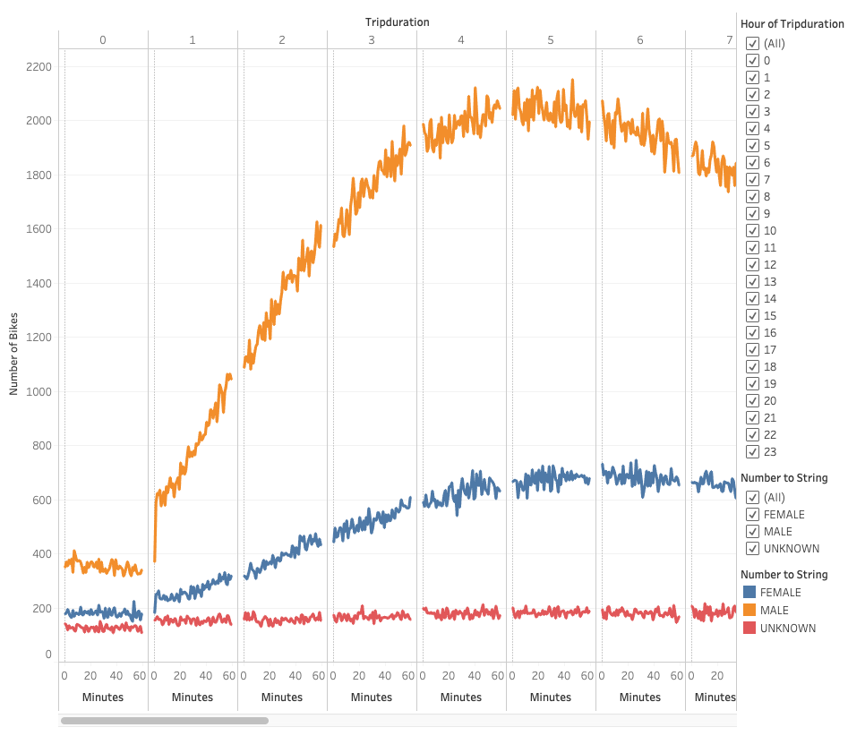
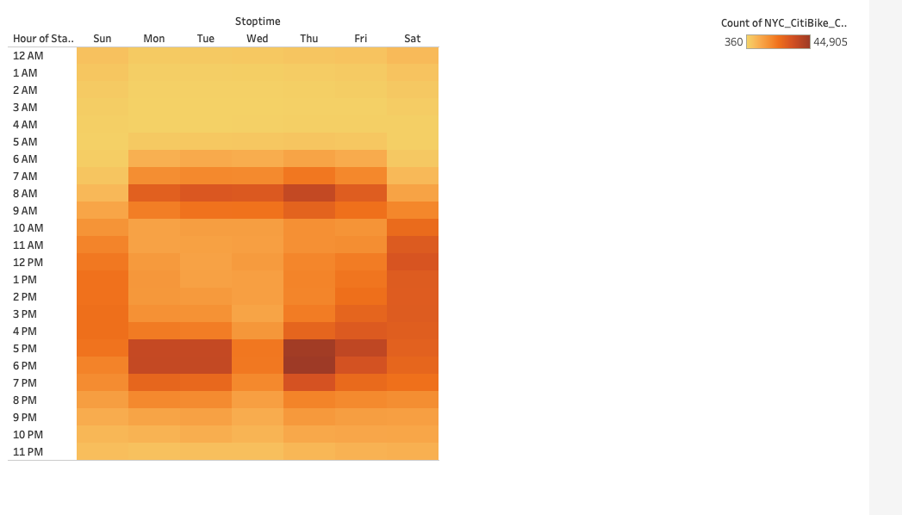
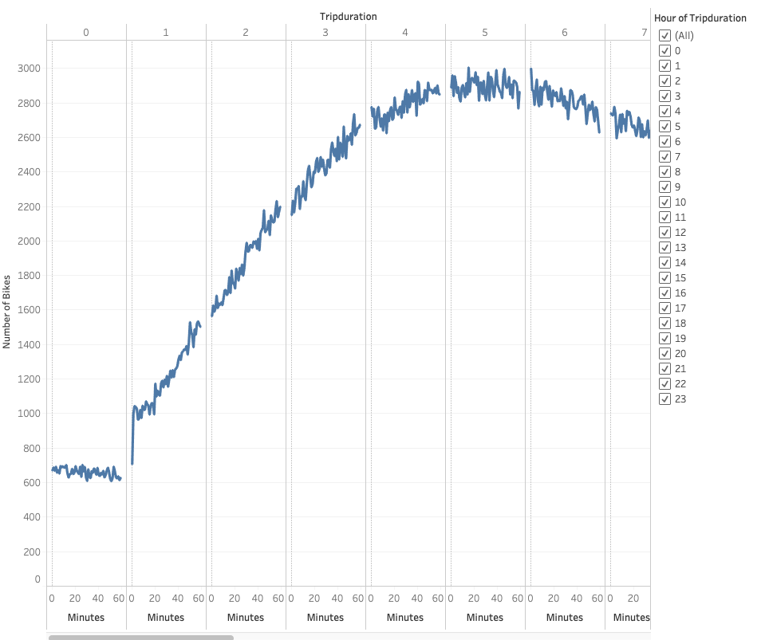
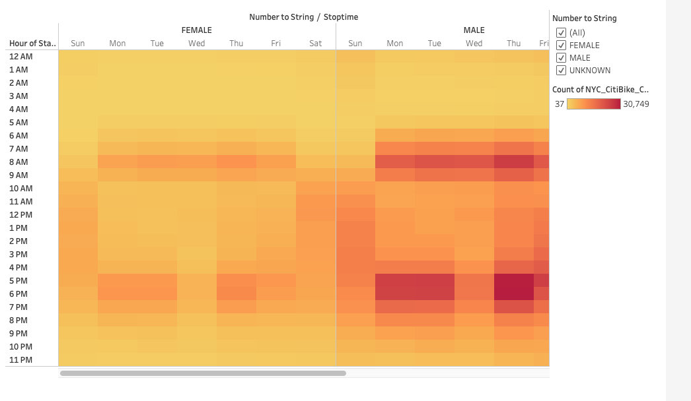
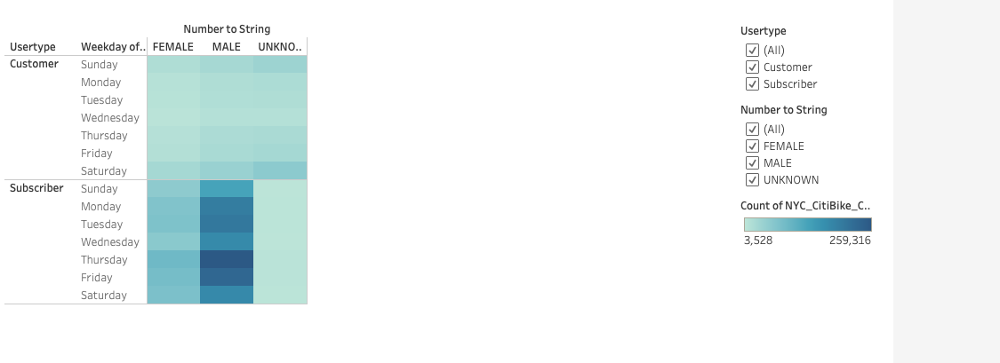
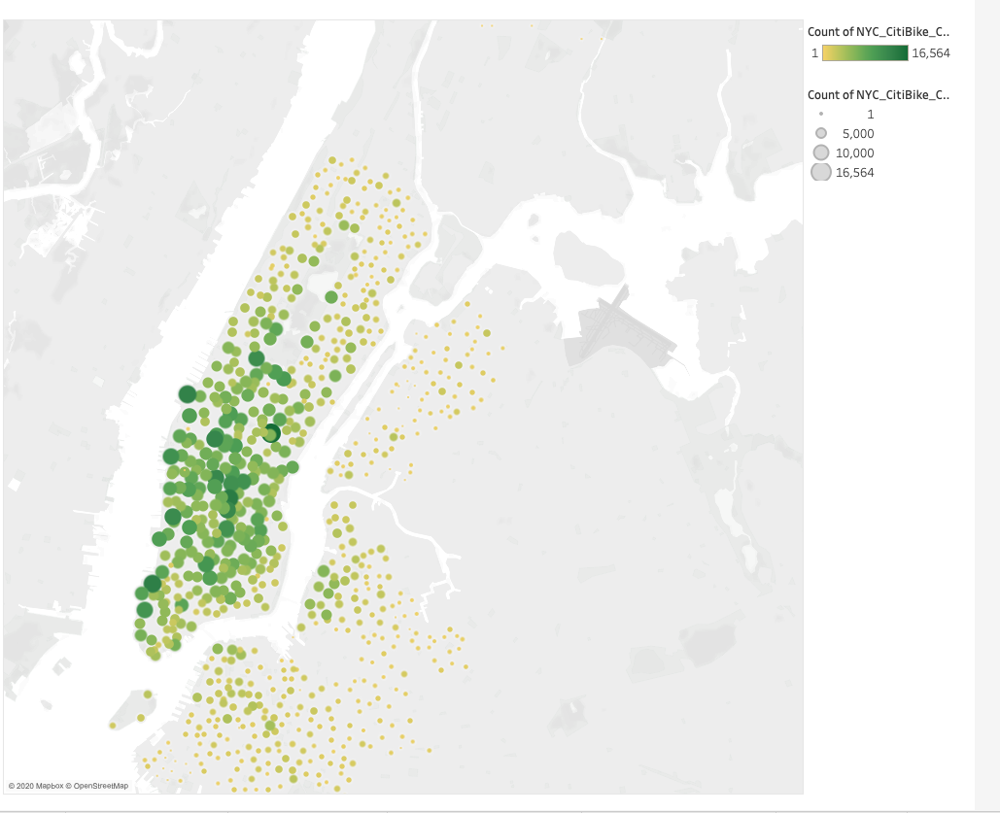
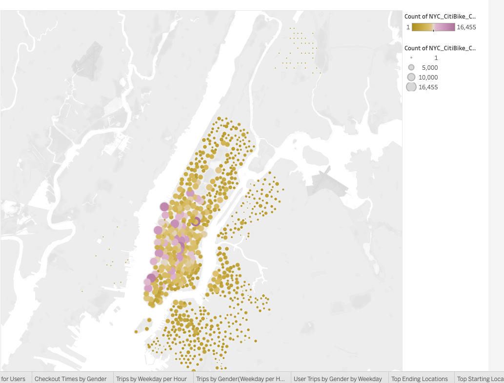

# Overview of the analysis

The main purpose of the analysis is to propose a bike-sharing program in Des Moines. 

As a first step, Python Pandas is used to change the "tripduration" column from an integer to a datetime datatype. Then using converted csv file, we would add visualizations in Tabluea worksheets and create a Tabluea story to do a final presentation 

# Results

### Visualization 1

As can be seen in, 

There are more number of MALE riders that rented for a duration of 4-6 hours compared to FEMALE and UNKNOWN. More users on an average for 4-6 hours of trip duration.

### Visualization 2

Thursday 6pm seems to be peak time on a weekday with the highest number of bike rides(44,905) and Tuesday 3AM saw lowest number of rides of only 360. On an average, Morning 8AM and evening 5PM-6PM are the peak hours during a weekday.

### Visualization 3

Highest numer of users between 4-6 hours of trip duration. Less number of users rented the bikes for under an hour and for more than 23 hours.

### Visualization 4

Highest number of trips made by MALE users during the hour of 6pm on Thursday(30,749). For the same hour on Thursday, the number of FEMALE users are 11,336 and UNKNOWN users are 2,820.

### Visualization 5

Highest number of riders are Subscribers and are MALE mostly rented on a Thursday and the count is 259,316. In FEMALE riders, highest subscriber count of 88,281 is also seen on a Thursday. In UNKNOWN gender highest subscrier count of 6082 is seen on Thursday as well.

For user type of customer, highest numer of rides took place on a Saturday for all 3 genders.

### Visualization 6

The most popular starting location with a total of 16,564 rides is East 24th Street & Park Avenue Bike station in New York.

### Visualization 7

The most popular end location with a total number of rides of 16,455 is also East 24th Street & Park Avenue Bike station in New York.

# Summary

Overall from all the visulations, we can conclude that there are more MALE riders compared to FEMALE/UNKNOWWN riders with an average trip duration of 4-6 hours and busiest time during weekday is Thursday 6pm and more riders have subscription. 

## Two Additional Visualizations

 - "Checkout Times by birth year" so that we can understand what age group is renting more bikes.
 - "User Trips by birth year by Weekday" to get an idea of number of bike trips by age for each hour for each day of the week.